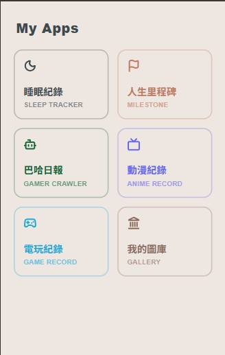
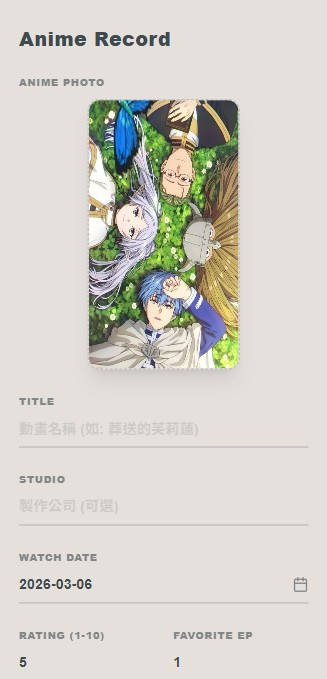
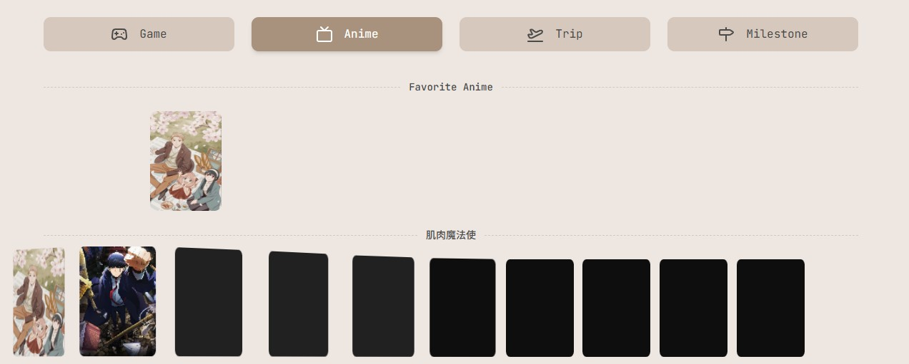

## Record Tracker

A full-stack, mobile-first personal tracking system built with Next.js (App Router), Supabase (PostgreSQL), and Google Cloud Storage (GCP).

## Preview

## Why I Made This

I built this project to create a simple way (mobile) to upload my favorite images, life track and much more.
It provides a seamless data entry experience for managing various personal records (Games, Anime, Milestones, and Artworks) through a highly modular architecture.
Of course, with AI (Gemini), but I am for sure I understand every code inside the project due to my web dev experience before.

## Features

- Client-Side Image Processing: Utilizes the HTML5 Canvas API to perform edge-level image resizing, smart rotation (auto-portrait for galleries), and metadata extraction (dimensions, file size) before uploading, drastically reducing server compute and bandwidth.

- Dynamic Serverless Storage: A flexible API route that dynamically distributes files to specific flat-structured GCP Buckets based on payload types. Implements SHA-256 hashing on file buffers to generate unique filenames, ensuring flawless deduplication and cache management.

- Robust Data Architecture: Deep integration with Supabase featuring Row Level Security (RLS) for data protection, automated payload sanitization (e.g., parsing comma-separated strings into PostgreSQL text[] arrays), and a DRY-focused UI component library.

## Tech Stack

- Framework: Next.js (App Router)

- Database & Auth: Supabase (PostgreSQL)

- Cloud Storage: Google Cloud Storage (GCP)

- Styling & UI: Tailwind CSS, Lucide React, Sonner

- Deployment: Vercel

## Record Display (on other website)

